# 📚 Manuel d'Utilisation ImpactData
## Système de Gestion des Adhérents et Organisations

---

## 📋 Table des Matières

1. [Introduction et Connexion](#introduction-et-connexion)
2. [Tableaux de Bord](#tableaux-de-bord)
3. [Gestion des Adhérents](#gestion-des-adhérents)
4. [Gestion des Organisations](#gestion-des-organisations)
5. [Système de Badges](#système-de-badges)
6. [Gestion des Interactions](#gestion-des-interactions)
7. [Gestion des Utilisateurs](#gestion-des-utilisateurs)
8. [Objectifs et Suivi](#objectifs-et-suivi)
9. [Recherche et Filtres](#recherche-et-filtres)
10. [Paramètres et Configuration](#paramètres-et-configuration)
11. [Rapports et Export](#rapports-et-export)
12. [Dépannage](#dépannage)

---

## 🔐 Introduction et Connexion

### Qu'est-ce qu'ImpactData ?

ImpactData est un système complet de gestion des adhérents et organisations qui permet de :
- Gérer des milliers d'adhérents et d'organisations
- Générer des badges avec codes QR
- Suivre les interactions et objectifs
- Gérer les permissions et rôles utilisateurs

### Types d'Utilisateurs

Le système propose trois types d'utilisateurs :

| Rôle | Permissions | Description |
|------|-------------|-------------|
| **Administrateur** | Accès complet | Gestion complète du système, tous les utilisateurs |
| **Superviseur** | Gestion des agents | Gestion des adhérents, organisations, interactions |
| **Agent** | Saisie de données | Consultation et saisie des données |

### Hiérarchie des Rôles

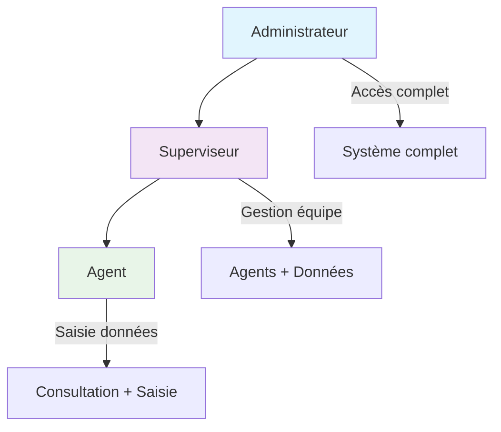

### Flux d'Accès aux Fonctionnalités

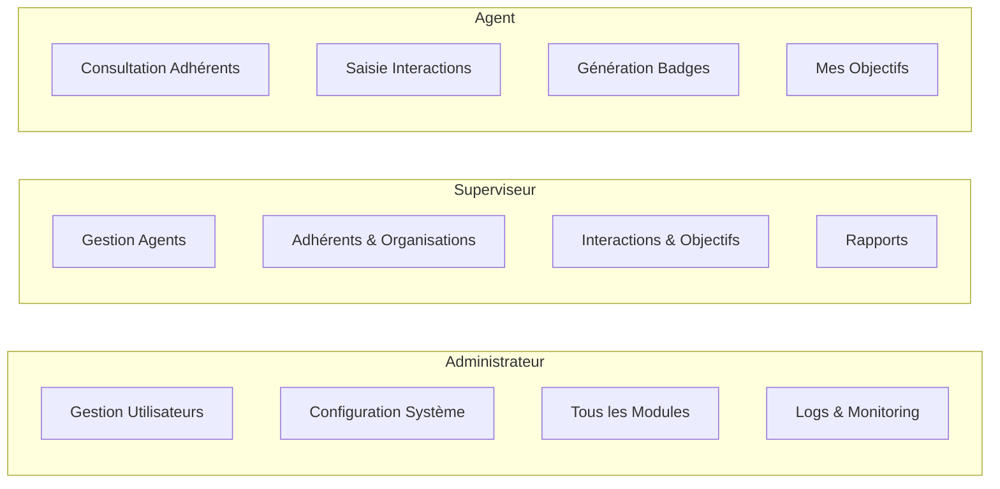

### Connexion au Système

1. **Accéder à l'application** : Ouvrez votre navigateur et allez à l'adresse fournie
2. **Page de connexion** : Saisissez vos identifiants
   - **Email** : Votre adresse email professionnelle
   - **Mot de passe** : Votre mot de passe
3. **Première connexion** : Si c'est votre première connexion, vous devrez changer votre mot de passe
4. **Connexion** : Cliquez sur "Se connecter"

### Récupération de Mot de Passe

1. Sur la page de connexion, cliquez sur "Mot de passe oublié ?"
2. Saisissez votre adresse email
3. Vérifiez votre boîte email pour le lien de réinitialisation
4. Suivez les instructions dans l'email

---

## 📊 Tableaux de Bord

### Tableau de Bord Administrateur

**Accès** : Administrateurs uniquement

**Fonctionnalités** :
- Vue d'ensemble complète du système
- Statistiques globales (adhérents, organisations, interactions)
- Gestion des utilisateurs
- Configuration du système
- Logs et monitoring

### Tableau de Bord Superviseur

**Accès** : Superviseurs et Administrateurs

**Fonctionnalités** :
- Statistiques de votre équipe
- Suivi des objectifs des agents
- Gestion des adhérents et organisations
- Supervision des interactions
- Rapports de performance

### Tableau de Bord Agent

**Accès** : Tous les utilisateurs

**Fonctionnalités** :
- Vos statistiques personnelles
- Vos objectifs assignés
- Accès rapide aux fonctionnalités principales
- Notifications d'interactions en cours

### Architecture des Tableaux de Bord

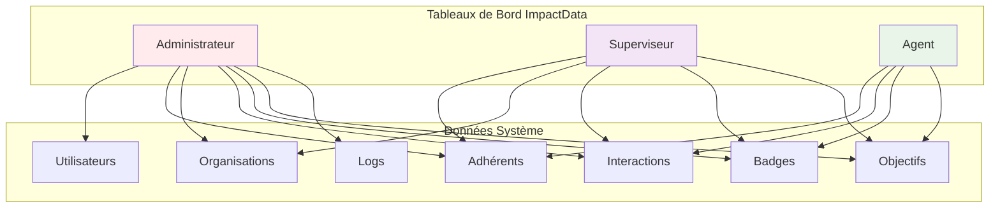

---

## 👥 Gestion des Adhérents

### Créer un Nouvel Adhérent

1. **Accéder** : Menu principal → "Adhérents" → "Nouvel Adhérent"
2. **Vérification téléphone** : Saisissez le numéro de téléphone principal
3. **Informations personnelles** :
   - Prénom et nom
   - Date de naissance (optionnel)
   - Type d'adhérent (Personne Physique ou Morale)
   - Email (optionnel)

4. **Informations de contact** :
   - Commune, quartier, secteur
   - Téléphone principal (obligatoire)
   - Téléphone secondaire (optionnel)
   - Numéros d'urgence (optionnels)

5. **Informations complémentaires** :
   - Informations médicales
   - Formation professionnelle
   - Distinctions
   - Langues parlées

6. **Informations d'adhésion** :
   - Date d'adhésion
   - Organisation d'appartenance
   - Nom de l'activité
   - Validité du badge

7. **Photo de profil** : Upload optionnel d'une photo
8. **Validation** : Cliquez sur "Enregistrer"

### Processus de Création d'Adhérent

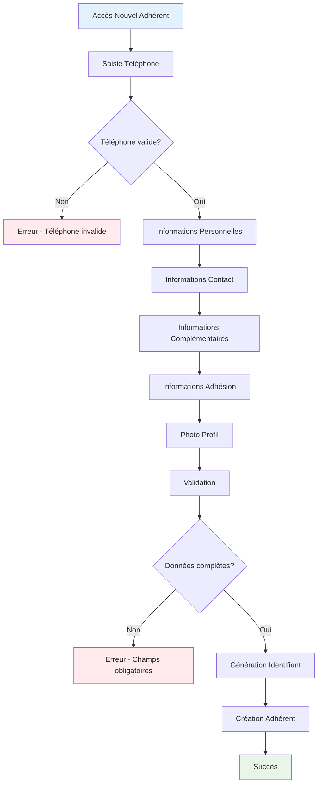

### Structure des Données Adhérent

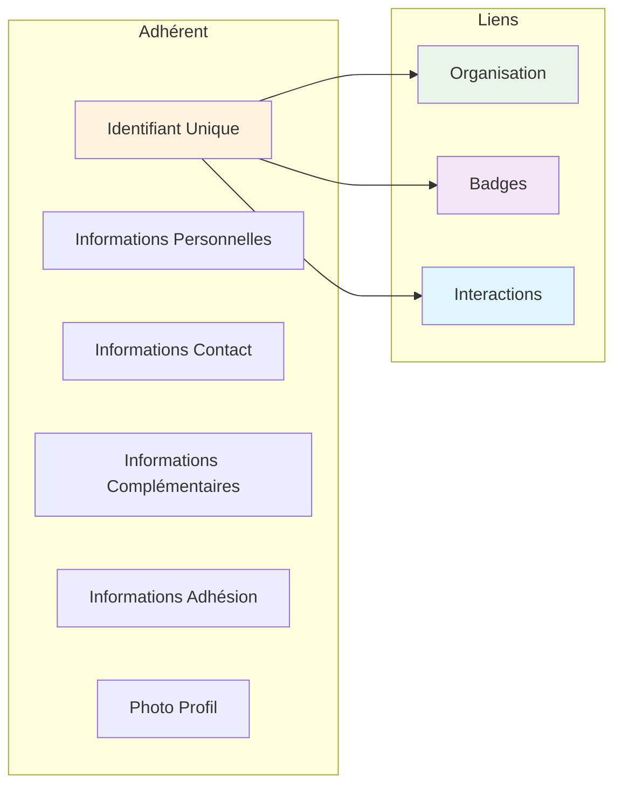

### Modifier un Adhérent

1. **Rechercher** l'adhérent via la liste ou la recherche
2. **Cliquer** sur le nom de l'adhérent
3. **Modifier** les informations nécessaires
4. **Sauvegarder** les modifications

### Consulter les Détails d'un Adhérent

1. **Accéder** à la fiche de l'adhérent
2. **Informations disponibles** :
   - Toutes les informations saisies
   - Historique des interactions
   - Badges générés
   - Statistiques d'activité

### Supprimer un Adhérent

⚠️ **Attention** : Cette action est irréversible !

1. **Accéder** à la fiche de l'adhérent
2. **Cliquer** sur "Supprimer"
3. **Confirmer** la suppression

---

## 🏢 Gestion des Organisations

### Créer une Nouvelle Organisation

1. **Accéder** : Menu principal → "Organisations" → "Nouvelle Organisation"
2. **Informations générales** :
   - Nom de l'organisation
   - Chiffre d'affaires mensuel (optionnel)
   - Adresse complète
   - Date de création (optionnel)

3. **Informations de contact** :
   - Téléphone principal (obligatoire)
   - WhatsApp (optionnel)

4. **Informations complémentaires** :
   - Catégorie d'organisation
   - Nombre de personnel
   - Informations annexes
   - Hobbies/centres d'intérêt

5. **Validation** : Cliquez sur "Enregistrer"

### Gérer les Organisations

**Fonctionnalités disponibles** :
- **Modifier** : Informations de l'organisation
- **Consulter** : Liste des adhérents de l'organisation
- **Supprimer** : Organisation (avec confirmation)

---

## 🏷️ Système de Badges

### Générer un Badge pour un Adhérent

**Prérequis** : L'adhérent doit avoir un nom d'activité et une validité de badge renseignés.

1. **Accéder** à la fiche de l'adhérent
2. **Cliquer** sur "Générer Badge"
3. **Le système génère automatiquement** :
   - Numéro de badge unique
   - Code QR
   - Image du badge

### Télécharger un Badge

1. **Accéder** à la fiche du badge
2. **Options disponibles** :
   - **PDF** : Pour impression
   - **JPG** : Pour utilisation numérique

### Scanner un Badge QR

1. **Accéder** : Menu principal → "Badges" → "Scanner Badge"
2. **Utiliser** un scanner QR ou la caméra du téléphone
3. **Résultat** : Affichage des informations de l'adhérent

### Gérer les Statuts de Badge

**Statuts disponibles** :
- **Actif** : Badge valide et utilisable
- **Expiré** : Badge passé sa date de validité
- **Révoqué** : Badge annulé par un administrateur

**Actions possibles** :
- **Révoquer** : Annuler un badge actif
- **Réactiver** : Remettre en service un badge révoqué

### Cycle de Vie d'un Badge

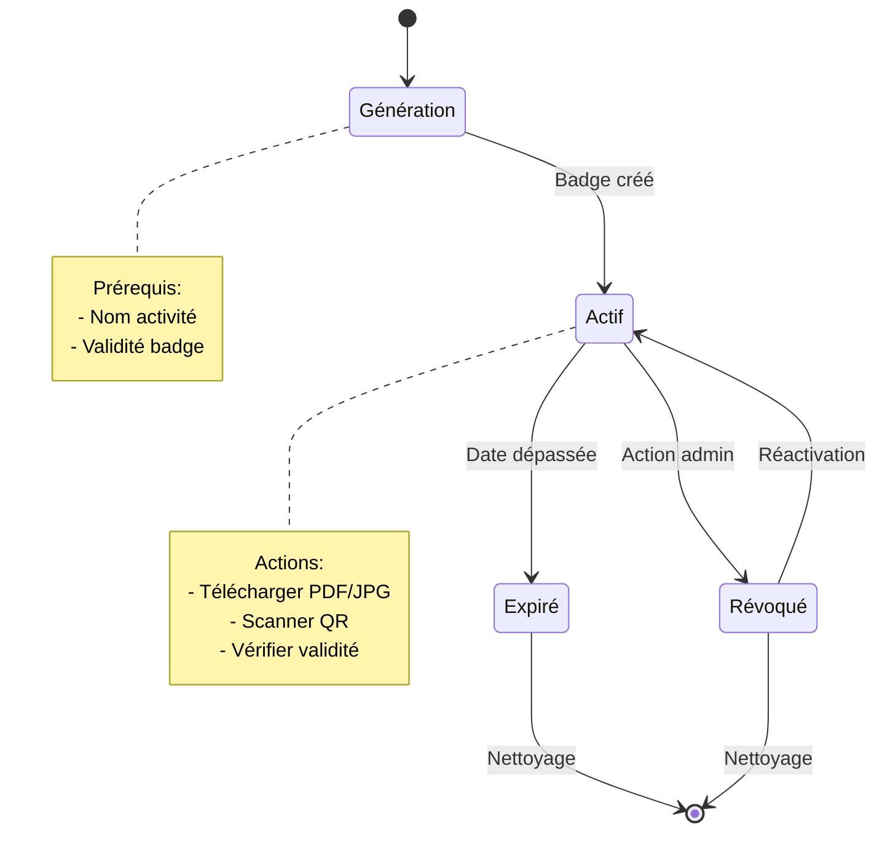

### Processus de Génération de Badge

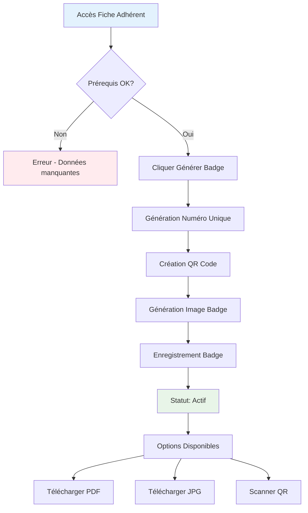

### Architecture du Système de Badges

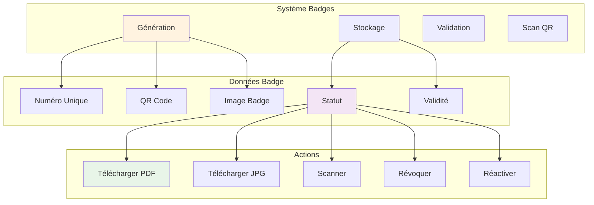

---

## 📞 Gestion des Interactions

### Créer une Nouvelle Interaction

1. **Accéder** : Menu principal → "Interactions" → "Nouvelle Interaction"
2. **Sélectionner** :
   - Adhérent concerné
   - Personnel responsable
   - Date d'échéance

3. **Rédiger** le rapport détaillé
4. **Définir** le statut initial (généralement "En cours")
5. **Enregistrer** l'interaction

### Suivre les Interactions

**Statuts disponibles** :
- **En cours** : Interaction active
- **Terminé** : Interaction clôturée
- **Annulé** : Interaction annulée

**Fonctionnalités** :
- **Modifier** : Changer le statut ou le rapport
- **Consulter** : Voir l'historique complet
- **Notifications** : Alertes pour les échéances proches

---

## 👤 Gestion des Utilisateurs

### Créer un Nouvel Utilisateur (Administrateurs/Superviseurs)

1. **Accéder** : Menu principal → "Utilisateurs" → "Nouvel Utilisateur"
2. **Informations obligatoires** :
   - Email (unique)
   - Matricule (unique)
   - Prénom et nom
   - Téléphone
   - Profession
   - Rôle (Administrateur/Superviseur/Agent)

3. **Informations complémentaires** :
   - Fonction
   - Adresse
   - Contacts d'urgence

4. **Sécurité** :
   - Mot de passe (généré automatiquement si non fourni)
   - Le nouvel utilisateur devra le changer à sa première connexion

### Gérer les Utilisateurs

**Actions disponibles** :
- **Modifier** : Informations de l'utilisateur
- **Activer/Désactiver** : Contrôler l'accès
- **Réinitialiser mot de passe** : Forcer un nouveau mot de passe
- **Gérer les permissions** : Configurer les accès spécifiques

---

## 🎯 Objectifs et Suivi

### Assigner un Objectif (Superviseurs/Administrateurs)

1. **Accéder** : Menu principal → "Objectifs" → "Nouvel Objectif"
2. **Sélectionner** l'utilisateur concerné
3. **Définir** :
   - Type d'objectif (Organisations, Adhérents, Interactions)
   - Valeur cible
   - Date limite
   - Description

4. **Le système calcule automatiquement** :
   - Valeur de base (ce qui existait déjà)
   - Valeur cible finale
   - Progression en temps réel

### Suivre les Objectifs

**Informations affichées** :
- **Progression** : Pourcentage d'avancement
- **Statut** : En attente, En cours, Terminé, Échoué
- **Détails** : Valeurs actuelles vs cibles
- **Délais** : Alertes pour les échéances proches

### Cycle de Vie des Objectifs

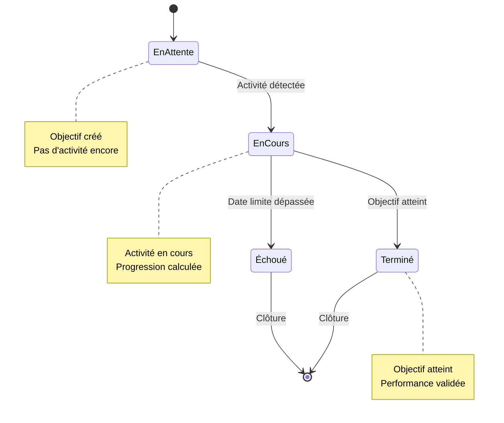

### Calcul de Progression des Objectifs

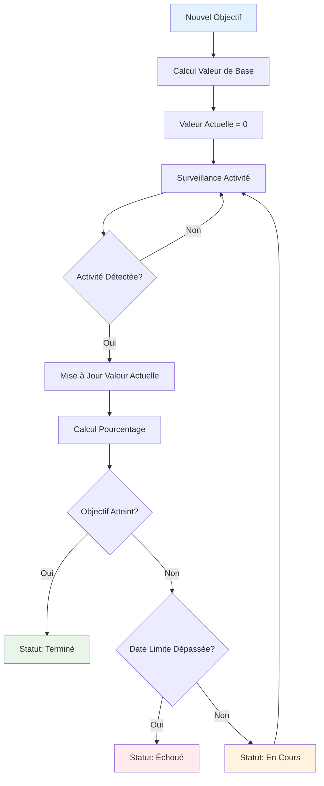

### Types d'Objectifs

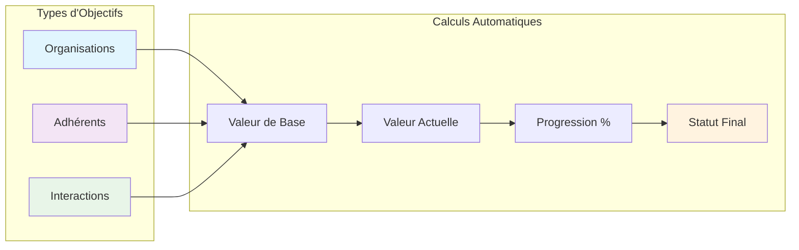

---

## 🔍 Recherche et Filtres

### Recherche Globale

1. **Accéder** à la barre de recherche en haut de l'écran
2. **Saisir** un terme de recherche
3. **Résultats** : Affichage de tous les éléments correspondants (adhérents, organisations, interactions)

### Filtres Avancés

**Pour les Adhérents** :
- Par organisation
- Par date d'adhésion
- Par type d'adhérent
- Par statut de badge

**Pour les Organisations** :
- Par catégorie
- Par chiffre d'affaires
- Par nombre de personnel

**Pour les Interactions** :
- Par statut
- Par personnel responsable
- Par période
- Par adhérent

### Suggestions de Recherche

Le système propose des suggestions automatiques pendant la saisie pour faciliter la recherche.

### Architecture de Recherche

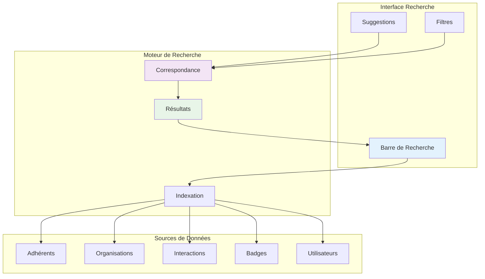

### Processus de Recherche

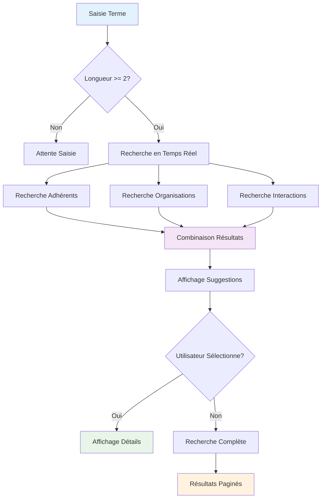

### Types de Filtres Disponibles

```mermaid
mindmap
  root((Filtres ImpactData))
    Adhérents
      Organisation
      Date Adhésion
      Type Adhérent
      Statut Badge
      Téléphone
      Email
    Organisations
      Catégorie
      Chiffre Affaires
      Nombre Personnel
      Date Création
      Adresse
    Interactions
      Statut
      Personnel
      Période
      Adhérent
      Date Échéance
    Badges
      Statut
      Date Émission
      Validité
      Adhérent
    Utilisateurs
      Rôle
      Statut Actif
      Date Création
      Matricule
```

---

## ⚙️ Paramètres et Configuration

### Paramètres Généraux (Administrateurs)

1. **Accéder** : Menu principal → "Paramètres" → "Paramètres Généraux"
2. **Sections configurables** :
   - **Informations organisation** : Nom, adresse, contacts
   - **Configuration système** : Fuseau horaire, format de dates
   - **Configuration email** : Serveur SMTP, notifications
   - **Sécurité** : Politiques de mots de passe, sessions
   - **Interface** : Nombre d'éléments par page, notifications

### Gestion des Rôles et Permissions

1. **Accéder** : Menu principal → "Paramètres" → "Rôles et Permissions"
2. **Configurer** les permissions par rôle :
   - Permissions de lecture/écriture
   - Accès aux modules spécifiques
   - Restrictions par données

### Valeurs de Référence

1. **Accéder** : Menu principal → "Paramètres" → "Valeurs de Référence"
2. **Gérer** les listes déroulantes :
   - Types de profession
   - Statuts d'interaction
   - Catégories d'organisation
   - Et autres valeurs système

---

## 📈 Rapports et Export

### Générer des Rapports

1. **Accéder** aux différents modules (Adhérents, Organisations, etc.)
2. **Utiliser** les filtres pour cibler les données
3. **Exporter** au format souhaité (PDF, Excel, CSV)

### Types de Rapports Disponibles

**Rapports d'adhérents** :
- Liste complète avec filtres
- Statistiques par organisation
- Adhérents avec badges actifs/expirés

**Rapports d'organisations** :
- Liste par catégorie
- Statistiques financières
- Organisations par superviseur

**Rapports d'interactions** :
- Interactions par période
- Performance du personnel
- Interactions en retard

### Export de Données

**Formats supportés** :
- **PDF** : Pour impression et archivage
- **Excel** : Pour analyse et traitement
- **CSV** : Pour import dans d'autres systèmes

---

## 🚨 Dépannage

### Problèmes de Connexion

**Erreur "Identifiants incorrects"** :
1. Vérifiez votre email et mot de passe
2. Utilisez la fonction "Mot de passe oublié"
3. Contactez votre administrateur si le problème persiste

**Erreur "Compte verrouillé"** :
1. Attendez 24 heures (verrouillage automatique)
2. Contactez votre administrateur pour déverrouillage immédiat

### Problèmes de Performance

**Pages qui se chargent lentement** :
1. Vérifiez votre connexion internet
2. Réduisez le nombre de filtres appliqués
3. Contactez l'administrateur système

### Problèmes de Génération de Badges

**Erreur "Impossible de générer le badge"** :
1. Vérifiez que l'adhérent a un nom d'activité
2. Vérifiez que la validité du badge est renseignée
3. Vérifiez l'espace disque disponible

### Problèmes d'Email

**Emails non reçus** :
1. Vérifiez votre dossier spam
2. Vérifiez l'adresse email dans votre profil
3. Contactez l'administrateur pour vérifier la configuration

### Support Technique

**En cas de problème persistant** :
1. **Documentez** le problème (message d'erreur, étapes reproduites)
2. **Contactez** votre administrateur système
3. **Fournissez** :
   - Votre nom d'utilisateur
   - Description détaillée du problème
   - Capture d'écran si possible

---

## 📞 Contacts et Ressources

### Contacts Administratifs

- **Administrateur système** : [email]
- **Support technique** : [email]
- **Superviseur** : [email]

### Ressources Utiles

- **Documentation technique** : Consultez l'administrateur
- **Formation** : Sessions de formation disponibles sur demande
- **Mises à jour** : Les nouvelles fonctionnalités sont communiquées par email

### Bonnes Pratiques

**Sécurité** :
- Changez votre mot de passe régulièrement
- Ne partagez jamais vos identifiants
- Déconnectez-vous après utilisation

**Données** :
- Saisissez des informations complètes et exactes
- Mettez à jour régulièrement les informations
- Respectez la confidentialité des données

**Performance** :
- Utilisez les filtres pour limiter les résultats
- Fermez les onglets non utilisés
- Signalez les problèmes de performance

### Architecture Générale du Système

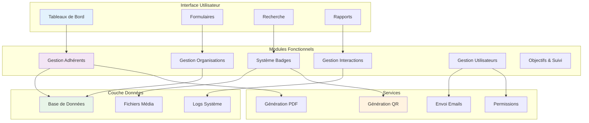

### Flux de Données Principal

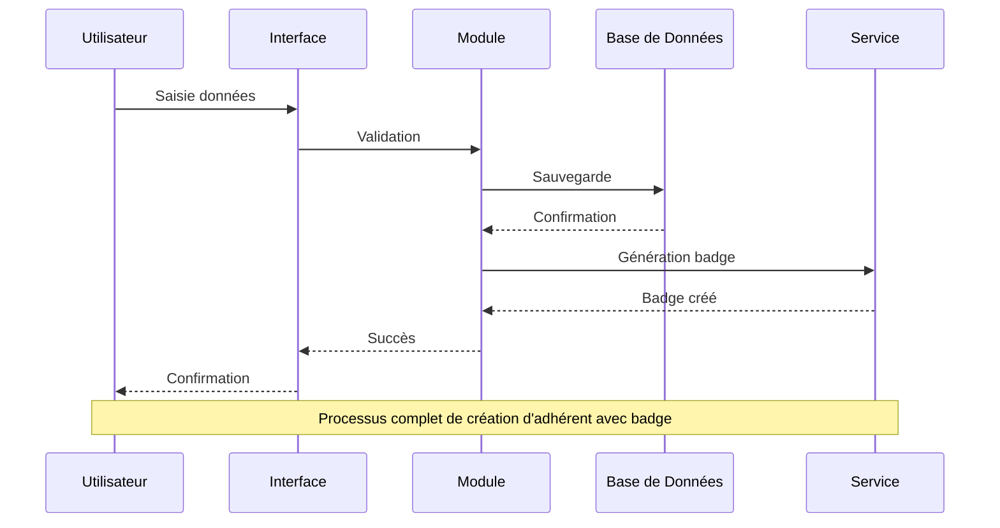

---

## 📝 Changelog et Mises à Jour

### Version Actuelle : 1.0

**Fonctionnalités principales** :
- Gestion complète des adhérents et organisations
- Système de badges avec QR codes
- Gestion des interactions et objectifs
- Système de permissions dynamiques
- Recherche globale et filtres avancés
- Rapports et exports multiples

**Prochaines versions** :
- Notifications push en temps réel
- Application mobile dédiée
- API pour intégrations externes
- Tableaux de bord personnalisables

### Roadmap des Fonctionnalités

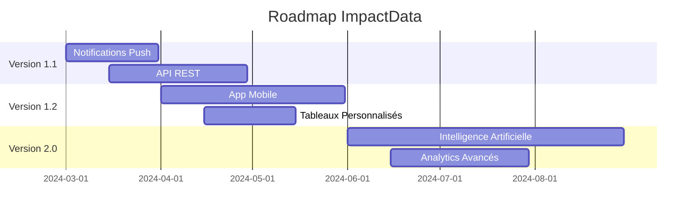

---

**ImpactData** - Système de gestion des adhérents et organisations  
*Manuel d'utilisation version 1.0*

Pour toute question ou suggestion d'amélioration, contactez votre administrateur système.
